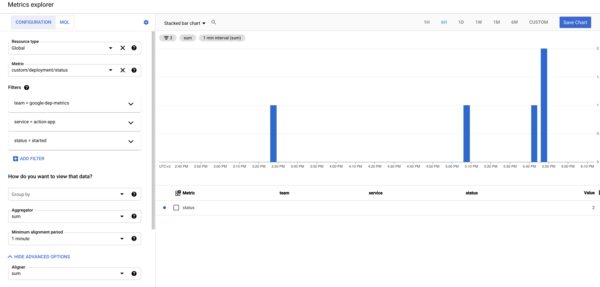

# google-dep-metrics

Generate deployment metrics from your workflow and send to Google Cloud Monitoring as custom metrics

## Purpose

In order to collect DORA metrics such as Deployment Frequency and (arguably depending on your definition) Change Failure Rate from a deployment in a workflow you need the capacity to send information about those deployments when they happen. When they start, for which service, environment, version, whether it was successful and other attributes.

This action allows you to hook into deployment workflows and send the information about them to Google Cloud Monitoring as custom metrics for reporting, visualisation and alerting.

## Pre-Requisites

- You will of course need a google cloud project to send the metrics too
- A service account key with role monitoring.admin
- The monitoring API enabled within your project

## Available Inputs

Unfortunately almost all inputs are mandatory as it is not easy to give sane defaults for most of them. But given its a copy / paste to different steps and only modifying 1-2 values each time, it's perhaps not so bad.

For wide scale adoption across multiple projects, consider using automatic values such as attributes of the github context object or outputs from previous steps. I will try to give some examples here - but go crazy!

| Input                     | Default | Details                                                                                                       | Possible Automatic Example                                |
| ------------------------- | ------- | ------------------------------------------------------------------------------------------------------------- | --------------------------------------------------------- |
| `google-cloud-project`    | none    | The Google Cloud project-id to which the metrics should be sent                                               | N/A                                                       |
| `service-account-keyfile` | none    | A secret holding the service account keyfile to use for authentication with your project                      | `${{ secrets.METRIC_SA_KEY }}`                            |
| `team`                    | none    | The name of the team the deployed service belongs to                                                          | `${{ github.repository_owner }}`                          |
| `service`                 | none    | The name of the service or application being deployed                                                         | Some trimming of the above to project name                |
| `environment`             | none    | The environment into which the service/application is being deployed                                          | `${{ github.ref }}`                                       |
| `status`                  | none    | What stage of the deployment process is occurring (suggest either 'started' or 'finished')                    | N/A                                                       |
| `result`                  | none    | The result so far. (suggest one of 'queued' 'pending' 'error' 'in_progress' 'failure' 'inactive' or 'success' | `${{ steps.deploy.outcome }}`                             |
| `version`                 | none    | The version or commit being deployed (e.g. v1.0.5 or git short SHA)                                           | `${{ github.sha }}` or `${{ github.ref }}` for production |

A recommendation of mine is also to use a slugify action early in your workflow to give you some much nicer values to play with as inputs such as SHORT_SHA's and Branch Names without needing to mess around stripping the lazy options Github actions provides!

## Example usage

Note we call the action once before deploying our app with `status: started` and `result:pending`. This gives us a metric that can be used for when and how often we have attempted to deploy.

Then after the deployment we call the action again and the only thing we change is status: finished and a result that is dependent on the out come of the deploy step. This is populated automatically by Github's [needs context](https://docs.github.com/en/actions/reference/context-and-expression-syntax-for-github-actions#needs-context) such as `success` or `failure`

```yaml
jobs:
  deploy-the-app:
    name: Production Deployemtn
    runs-on: ubuntu-latest
    steps:
      - name: Start
        uses: erzz/google-dep-metrics@v1
        with:
          google-cloud-project: my-project-id
          service-account-keyfile: ${{ secrets.METRICS_SA_KEY }}
          team: google-dep-metrics
          service: action-app
          environment: production
          status: started
          result: pending
          version: v1.0.3

      # NOTE THE id = deploy
      - name: Deploy Production
        id: deploy
        run: echo "Deployed"

      - name: Finish
        uses: erzz/google-dep-metrics@v1
        with:
          google-cloud-project: my-project-id
          service-account-keyfile: ${{ secrets.METRICS_SA_KEY }}
          team: google-dep-metrics
          service: action-app
          environment: production
          status: finished
          result: ${{ steps.deploy.outcome }}
          version: v1.0.3
```

## Using the data

**Special Note:** It can take 3-5 minutes for metrics to show up in google according to their SLA on metric latency ... so be a little patient if they don't appear immediately :)

I will try to populate some cool examples as I go along here. But a simple example is getting Deployment Frequency for a service. You will likely want to filter or group by environment for best results!


